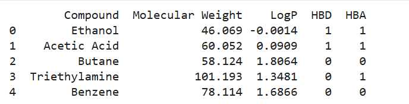
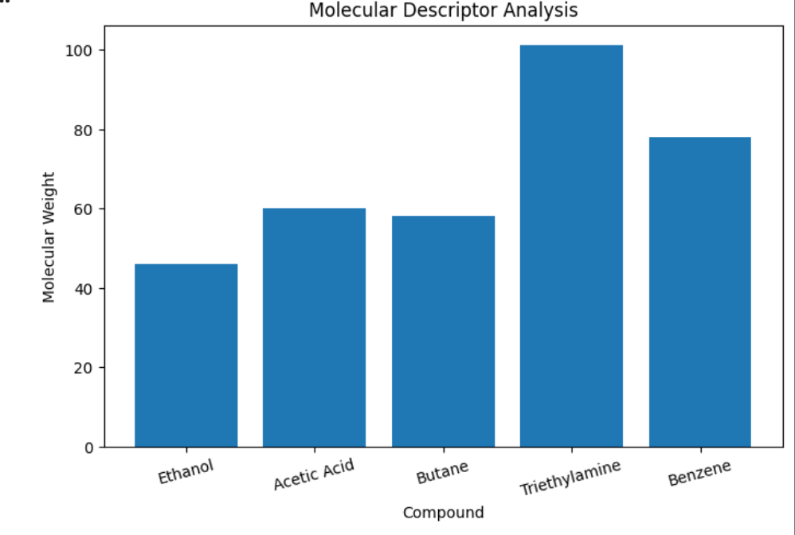

# molecular-descriptor-analysis
Molecular descriptor analysis using RDKit and Python
This project performs molecular descriptor analysis using RDKit and Python.

## Workflow
1. Input SMILES strings
2. Convert SMILES into molecular structures
3. Calculate molecular descriptors using RDKit
4. Store descriptor values in a pandas dataframe
5. Visualize descriptor distributions using matplotlib
## Features
- Reads SMILES strings
- Calculates molecular descriptors
- Visualizes descriptor data

## Descriptors Calculated
- Molecular Weight
- LogP
- Hydrogen Bond Donors
- Hydrogen Bond Acceptors

## Technologies Used
- Python
- RDKit
- Pandas
- Matplotlib

## Applications
- Bioinformatics
- Drug Discovery
- Computational Chemistry
## Future Improvements

- Add more molecular descriptors
- Integrate Machine Learning models
- Use larger drug datasets
- Develop interactive visualizations
## Output

### Compound Descriptor Table

### Molecular Descriptor Visualization

